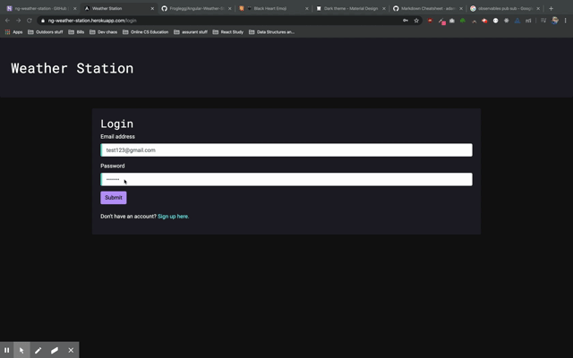

# NG Weather Station

NG Weather Station is a full stack CRUD weather application uses Angular and Observer design patterns in the front end framework, Node/Express in the backend, and MongoDB for database management. It utilizes Google Geocoding API and Dark Sky API to find weather based on user input, and uses JSON Web Tokens, Redis session cacheing, Angular services, pub/sub methods from the RxJS Library, password encryption, and protected Angular routes for User Authentication and Authorization. Frontend UI is inspired by [Material Design's dark theme](https://material.io/design/color/dark-theme.html).

Check it out! You can search for and save weather information from any locality in the world...



## Technologies used

- Angular, Node.js + Express, MongoDB + Mongoose
- Observable design patterns and [RxJS Library](https://angular.io/guide/rx-library)
- Google Geocoding API and Dark Sky API
- JWT, Express sessions, and Redis for scalable server-side user session cacheing
- UI inspired by [Material Design's dark theme](https://material.io/design/color/dark-theme.html).

## Starting the app locally

Dependencies include:

- Local install of MongoDB server and database
- Local install of Redis

Git clone and while in the project root directory, create a file called .env, and add the following enviornment variables, filling in blank '' keys where called for:

```

DARK_API=''
GOOGLE_API=''
JWT_KEY=''
MONGODB_URI=mongodb://localhost:27017/angular-weather-station
SESH_SECRET=''
REDIS_URL=localhost

```

While still in the project directory, run the following command:

```
npm install
```

This should install node modules within the server and the client folder.

After both installations complete, run the following command in your terminal:

```
npm start
```

Your app should now be running on <http://localhost:4200>. The Express server should intercept any API requests from the client.
